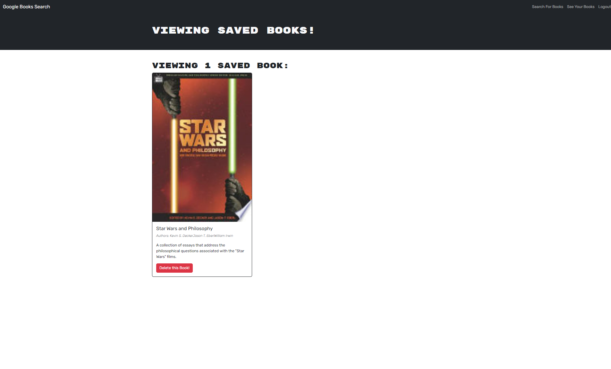

# ⭐ Book Search ⭐

## Description ✏️

This is an app that is a book search.  The user will be able to 
find new books to purchase and later read.

## User Story 📖

As a person who loves to read,
I want to search for new books to read,
so I can have a list of books to buy.

## Table of Contents 📖

- [Installation](#installation)
- [Usage](#usage)
- [Badges](#badges)
- [Credits](#credits)
- [License](#license)
- [Features](#features)

## Installation & Requirements 🔑

This can be viewed through this Heroku link: https://cfbook-search.herokuapp.com/ 

## Usage &#128161;

[Repository link](https://github.com/123sites/book-search)

This can be used for by anyone who is looking for a specific book.

## Screenshot 🎯

## Credits & Questions 👈

For this Challenge, I utilized code from the 21-MERN Bootcamp folder and 
I reached-out to get help from a tutor, if I needed help.

## License 📝

The MIT license is in the GitHub repository. Click to link to view it:
[MIT License](https://github.com/123sites/book-search/blob/main/LICENSE)

## Features ✍

- MERN Stack

